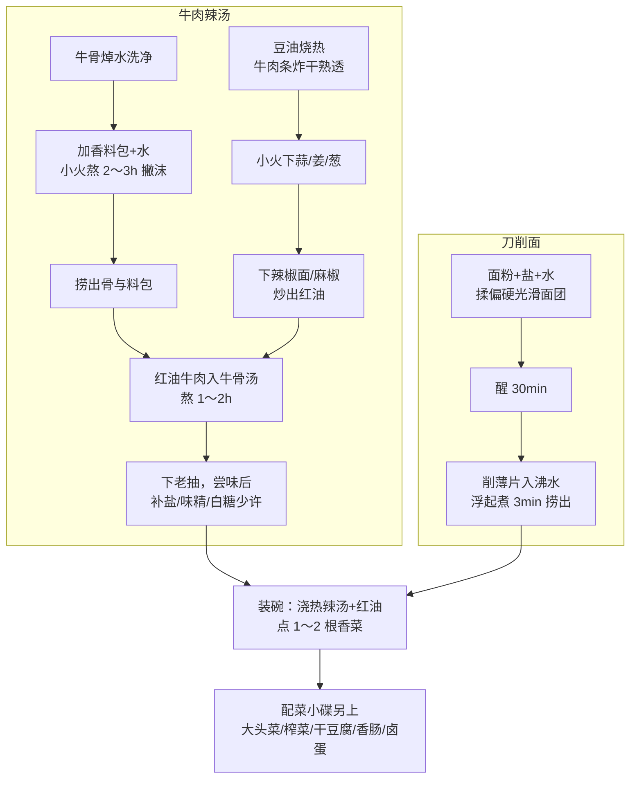
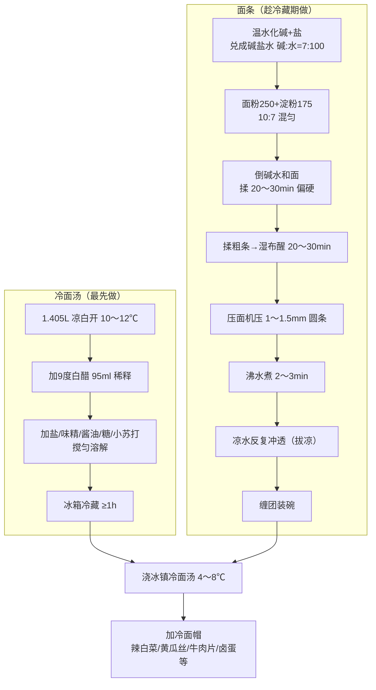
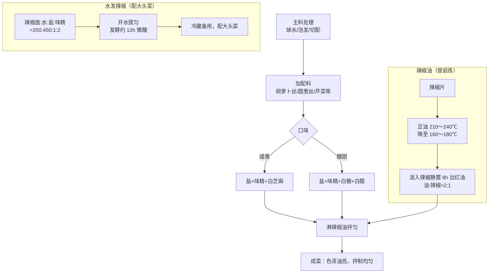

# 鸡西大冷面 · 刀削面 · 辣菜 — 制作流程图（Mermaid）

## 一、鸡西刀削面

```mermaid
flowchart TD
  subgraph TANG["牛肉辣汤"]
    A1["牛骨焯水洗净"] --> A2["加香料包+水<br/>小火熬 2～3h 撇沫"]
    A2 --> A3["捞出骨与料包"]
    B1["豆油烧热<br/>牛肉条炸干熟透"] --> B2["小火下蒜/姜/葱"]
    B2 --> B3["下辣椒面/麻椒<br/>炒出红油"]
    A3 --> C1["红油牛肉入牛骨汤<br/>熬 1～2h"]
    B3 --> C1
    C1 --> C2["下老抽，尝味后<br/>补盐/味精/白糖少许"]
  end
  subgraph MIAN["刀削面"]
    D1["面粉+盐+水<br/>揉偏硬光滑面团"] --> D2["醒 30min"]
    D2 --> D3["削薄片入沸水<br/>浮起煮 3min 捞出"]
  end
  C2 --> E["装碗：浇热辣汤+红油<br/>点 1～2 根香菜"]
  D3 --> E
  E --> F["配菜小碟另上<br/>大头菜/榨菜/干豆腐/香肠/卤蛋"]
```

---

## 二、鸡西大冷面（先调汤，趁冷藏做面）

```mermaid
flowchart TD
  subgraph TANG["冷面汤（最先做）"]
    S1["1.405L 凉白开 10～12℃"] --> S2["加9度白醋 95ml 稀释"]
    S2 --> S3["加盐/味精/酱油/糖/小苏打<br/>搅匀溶解"]
    S3 --> S4["冰箱冷藏 ≥1h"]
  end
  subgraph MIAN["面条（趁冷藏期做）"]
    N1["温水化碱+盐<br/>兑成碱盐水 碱:水=7:100"] --> N2["面粉250+淀粉175<br/>10:7 混匀"]
    N2 --> N3["倒碱水和面<br/>揉 20～30min 偏硬"]
    N3 --> N4["揉粗条→湿布醒 20～30min"]
    N4 --> N5["压面机压 1～1.5mm 圆条"]
    N5 --> N6["沸水煮 2～3min"]
    N6 --> N7["凉水反复冲透（拔凉）"]
    N7 --> N8["缠团装碗"]
  end
  S4 --> G["浇冰镇冷面汤 4～8℃"]
  N8 --> G
  G --> H["加冷面帽<br/>辣白菜/黄瓜丝/牛肉片/卤蛋等"]
```

---

## 三、辣菜（凉拌通用流程）

```mermaid
flowchart TD
  subgraph YOU["辣椒油（提前炼）"]
    O1["辣椒片"] --> O2["豆油 210～240℃<br/>降至 160～180℃"]
    O2 --> O3["泼入辣椒静置 8h 出红油<br/>油:辣椒≈2:1"]
  end
  P1["主料处理<br/>焯水/泡发/切配"] --> P2["加配料<br/>胡萝卜丝/圆葱丝/芹菜等"]
  P2 --> Q{"口味"}
  Q -->|咸香| R1["盐+味精+白芝麻"]
  Q -->|酸甜| R2["盐+味精+白糖+白醋"]
  R1 --> Z["淋辣椒油拌匀"]
  R2 --> Z
  O3 --> Z
  Z --> ZZ["成菜：色泽油亮、拌制均匀"]

  subgraph SHUI["水发辣椒（配大头菜）"]
    W1["辣椒面:水:盐:味精<br/>=250:450:1:2"] --> W2["开水搅匀<br/>发酵约 12h 微酸"]
    W2 --> W3["冷藏备用，配大头菜"]
  end
```
